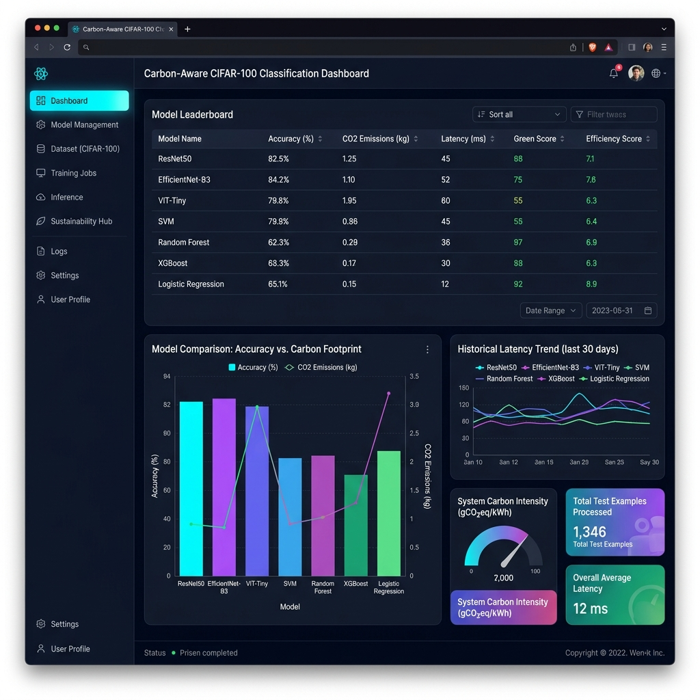
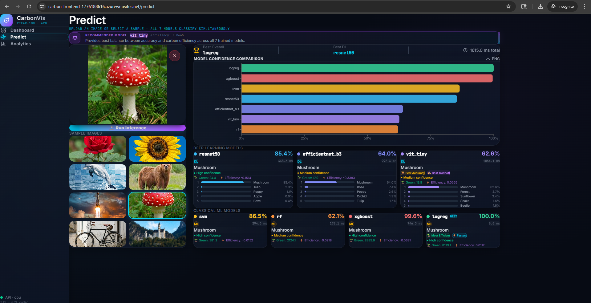
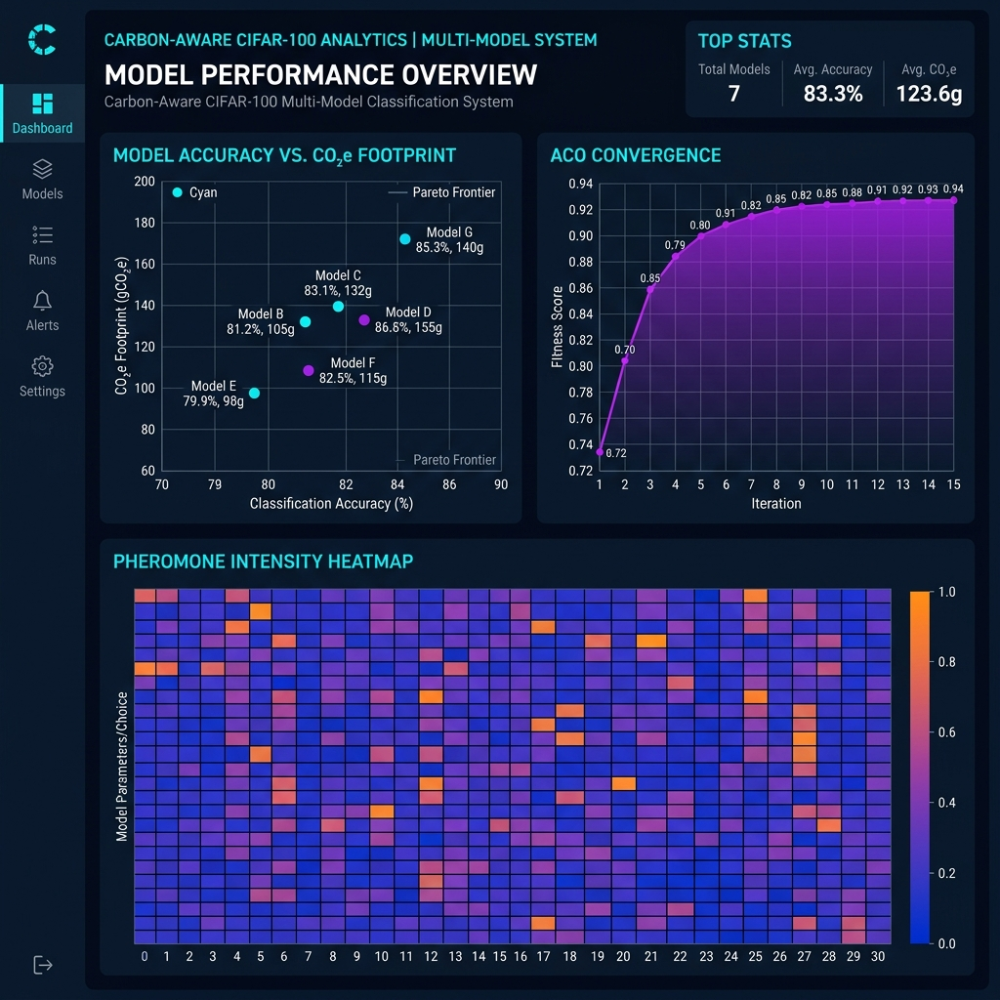

# Carbon-Aware Multi-Model CIFAR-100 Classification System

> A production-ready ML system that evaluates models not only by accuracy, but also by **carbon emissions** and **latency** — enabling principled, multi-objective model selection.

[](https://docker.com)
[](https://fastapi.tiangolo.com)
[](https://react.dev)
[](https://python.org)

---

## Overview

This system goes beyond traditional accuracy-only leaderboards. It tracks **CO₂ emissions** during training and inference for every model, computes **efficiency scores**, and uses **Ant Colony Optimization (ACO)** to recommend the best hyperparameters balancing performance against environmental cost.

The result is a full-stack ML observability platform: upload any image, get predictions from 7 models simultaneously, and see a detailed breakdown of which model delivers the best accuracy-per-gram-of-CO₂.

---

## Screenshots

| Dashboard | Prediction | Analytics |
|:---------:|:----------:|:---------:|
|  |  |  |

---

## Features

- **Multi-model inference** — 3 deep learning + 4 classical ML models run in parallel on every request
- **CO₂ emission tracking** — emissions logged per model, per epoch, aggregated and exposed via API
- **Efficiency evaluation** — Green Score and Efficiency Score computed across all 7 models
- **ACO hyperparameter optimization** — elitist Ant Colony Optimization selects optimal model, LR, weight decay, and epochs
- **Interactive analytics dashboard** — real-time charts: emission vs. accuracy scatter, ACO convergence curve, pheromone heatmap
- **Dockerized deployment** — single `docker compose up --build` starts the entire stack

---

## Architecture

```
User (Browser)
    │
    ▼
React + Vite SPA  (port 5173)
    │  served by nginx
    │  /api/* → reverse proxy
    ▼
FastAPI Backend  (port 8001)
    ├── POST /predict   →  7 models run concurrently
    ├── GET  /carbon    →  emission summaries from CSV artifacts
    ├── GET  /aco       →  ACO results from aco_logs.json
    ├── GET  /efficiency →  computed efficiency + rankings
    └── GET  /leaderboard → full model comparison table
         │
         ▼
    carbon_aco_artifacts/
         ├── leaderboard.json
         ├── emissions.csv
         ├── aco_logs.json
         ├── *_training_curves.json
         └── model checkpoints (.pt, .pkl)
```

---

## Efficiency Scoring System

### Green Score
> Measures accuracy delivered per unit of CO₂ emitted (higher = greener)

```
green_score = accuracy / CO₂_kg
```

### Efficiency Score
> Weighted composite ranking across all models

```
efficiency_score = 0.4 × acc_norm
                 − 0.3 × co2_norm
                 − 0.2 × lat_norm
```

Where each metric is normalized across all 7 models. **Confidence is not included in any scoring metric** — it is only used in `/predict` responses as a human-readable reliability label (`High / Medium / Low`).

### Model Rankings

| Ranking Dimension | Criterion |
|---|---|
| `best_accuracy` | Highest `test_acc1` |
| `most_efficient` | Highest `green_score` |
| `best_tradeoff` | Highest `efficiency_score` |
| `fastest` | Lowest `inference_latency_ms` |

---

## Models

### Deep Learning
| Model | Params | Input |
|---|---|---|
| ResNet50 | ~25M | 32×32 |
| EfficientNet-B3 | ~12M | 32×32 |
| ViT-Tiny | ~6M | 224×224 |

### Classical ML (ResNet50 embeddings → classifier)
| Model |
|---|
| SVM |
| Random Forest |
| XGBoost |
| Logistic Regression |

---

## Tech Stack

| Layer | Technology |
|---|---|
| **Backend** | FastAPI, PyTorch (CPU), timm, scikit-learn, XGBoost, joblib |
| **Frontend** | React 19, Vite 8, Recharts, Lucide Icons, React Router v7 |
| **Infra** | Docker, Docker Compose, Nginx (reverse proxy) |
| **Data** | CIFAR-100 (100 classes, 60k images) |

---

## Running with Docker

```bash
git clone https://github.com/karanLokhande29/EC_Project.git
cd EC_Project

docker compose up --build
```

| Service | URL |
|---|---|
| **Frontend** | [http://localhost:5173](https://carbon-frontend-1776188616.azurewebsites.net/) |
| **Backend API** | [http://localhost:8001](https://carbon-backend-1776188616.azurewebsites.net/) |
| **API Docs** | [http://localhost:8001/docs](https://carbon-backend-1776188616.azurewebsites.net/docs) |

> **Note:** Model checkpoint files (`.pt`, `.pkl`) are not tracked in Git due to size. Place them in `carbon_aco_artifacts/` before running.

---

## Project Structure

```
EC_Project/
├── backend/                    # FastAPI application
│   ├── main.py                 # App factory, leaderboard, predict endpoints
│   ├── carbon.py               # CO₂ emission analytics router
│   ├── aco.py                  # ACO optimization results router
│   ├── efficiency.py           # Green Score + Efficiency Score computation
│   ├── inference.py            # Multi-model inference pipeline
│   ├── model_loader.py         # Lazy-loading model registry (thread-safe)
│   ├── utils.py                # Device detection, image preprocessing
│   ├── requirements.txt
│   └── Dockerfile
│
├── frontend/                   # React + Vite SPA
│   ├── src/
│   │   ├── pages/              # Dashboard, Predict, Analytics pages
│   │   ├── components/         # Reusable UI components
│   │   ├── api/client.js       # API client (proxied through nginx)
│   │   └── hooks/              # Custom React hooks
│   ├── nginx.conf              # SPA serving + /api reverse proxy
│   └── Dockerfile              # Multi-stage: node build → nginx serve
│
├── carbon_aco_artifacts/       # Pre-computed training artifacts
│   ├── leaderboard.json        # Model rankings and metrics
│   ├── emissions.csv           # Consolidated CO₂ records
│   ├── aco_logs.json           # ACO iteration history + pheromones
│   ├── *_training_curves.json  # Per-model loss/accuracy curves
│   └── *.pt / *.pkl            # Model checkpoints (not tracked in git)
│
├── assets/                     # Screenshots for README
│   ├── dashboard.png
│   ├── predict.png
│   └── analytics.png
│
├── ec_training_model.py        # Full training pipeline (reference)
├── docker-compose.yml
├── .gitignore
└── README.md
```

---

## API Reference

| Method | Endpoint | Description |
|---|---|---|
| `POST` | `/predict` | Run image through all 7 models, return top-5 predictions per model |
| `GET` | `/leaderboard` | All 7 models ranked; supports `sort_by`, `order`, `model_type` filters |
| `GET` | `/efficiency` | Computed Green Score + Efficiency Score for all models |
| `GET` | `/carbon` | Aggregated CO₂ summary by model and type |
| `GET` | `/carbon/epoch/{model}` | Per-epoch emissions for a DL model |
| `GET` | `/aco` | Best ACO config + convergence statistics |
| `GET` | `/aco/history` | Full 15-iteration ACO convergence log |
| `GET` | `/aco/pheromones` | Final pheromone matrix (model × hyperparameter) |
| `GET` | `/health` | Service health check |

Full interactive docs: `http://localhost:8001/docs`

---

## Future Work

- **CI/CD pipeline** — GitHub Actions: lint → test → build → push to Docker Hub
- **Azure deployment** — Azure Container Apps or App Service with managed identity
- **Model compression** — Quantization, pruning, knowledge distillation to reduce inference CO₂
- **Real-time monitoring** — Live emission tracking with CodeCarbon during inference
- **Extended model zoo** — MobileNetV3, DeiT, ConvNeXt for broader Pareto frontier exploration
- **GitHub LFS** — Track model weights for full reproducibility
